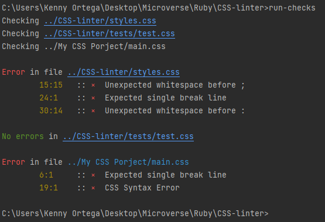

# CSS Linter built with Ruby

<!-- ABOUT THE PROJECT -->
## About The Project

This is a simple linter made for CSS, check for good practices in CSS files

## Rules

**Indentation**
* 2 space indentation rule

bad code:
```css
  a {
  color: red;
  }
```

good code:
```css
  a {
    color: red;
  }
```

**Line Format**
* One line checking
* Line missing between css blocks

bad code:
```css
h1 {
  font-family: Helvetica, Arial, sans-serif;
  font-size: 19px;
  color: blue;  
}
h2 {
  color: #111111;
  font-size: 16px;
}
```

good code:
```css
h1 {
    font-family: Helvetica, Arial, sans-serif;
    font-size: 19px;
    color: blue;
}

h2 {
    color: #111111;
    font-size: 16px;
}
```

**Spacing**
* Checking for missing spacing after **:** or **,**
* Checking for no whitespace before  **;** or **:**
* Checking for missing spacing after **{**
* Checking for line break after **{** or **}** and after each property declaration

bad code:

```css
a,p {
    color: red ;
    font-weight: bold;
}

div {
    color: blue;
    font-size : 18px;
}
```

good code:
```css
a, p {
  color: red;
  font-weight: bold;
}

div {
  color: blue;
  font-size: 18px;
} 
```

## Usage

The CSS Linter check your CSS file looking for common error and bad practices. Compare each line with a set of rules.

If an error is found, you can check the error message and the line where is generated.


**Examples**
- Bad Indentation, expected two spaces before property declaration
- Spacing, Expected single space after **:** and **,**
- Spacing, Unexpected spaces before **:** and **,**
- Spacing, Unexpected spaces after **{** or **;**
- Syntax, Good syntax when creating classes or declarations
- Syntax, Expected open and close curly brackets
- Line Format, Unexpected break lines
- Line Format, Expected single break line between classes

## Install & Run

* Make sure that **Ruby Environment** is installed in your computer (try to run _ruby_ from your prompt), if not you can install it from [here.](https://www.ruby-lang.org/en/downloads/)
  
* [Download](https://github.com/kensayo/CSS-linter/archive/refs/heads/develop.zip) and unzip **or** [clone this repository](https://docs.github.com/es/github/creating-cloning-and-archiving-repositories/cloning-a-repository):

* Make sure to unzip or clone this repository into you project folder, if not you can also unzip or clone on any folder, but you need to move manually your _**CSS**_ files into _**CSS-linter**_ folder.

* Open your terminal and navigate to _CSS-linter_ directory folder using [_**cd**_](https://www.google.com/search?q=how+to+use+cd+command&oq=how+to+use+cd) command (you can also use **ls** to check folders)

* After you verify that you are on _**CSS-linter**_ folder, you can now run the program with:
```
  $ run_linter
```
* Fix errors and run the program again to verify everything is ok.

* Repeat until all errors are fixed. 

## Screenshot


```
Example output, when there are errors in some files.
```

## Output interpretation

* Print checked folders.
* Mark when there is an error on the previously checked file printing CSS file path.
* First part print _XX:YY_ where _XX_ mark the line and _YY_ marks the column.
* After _**×**_ is printed the error message with the specification.

## Run test

* You can run tests using _**RSpec**_

* Move to _**CSS linter**_ folder using [_**cd**_](https://www.google.com/search?q=how+to+use+cd+command&oq=how+to+use+cd) command (you can also use **ls** to check folders)

* Now that you are in the main folder, you can run _RSpec_ 

### Built With
This project was built using these technologies.
* Ruby
* Rspec
* Rubocop
* Ruby Mine

## Contributors

**👤 Kenny Ortega**

- GitHub: [kensayo](https://github.com/kensayo)
- Twitter: [@kensayo](https://twitter.com/kensayo)
- LinkedIn: [LinkedIn](https://www.linkedin.com/in/kenny-ortega-3580aa33/)

## :handshake: Contributing
Contributions, issues and feature requests are welcome!
Feel free to check the [issues page](https://github.com/kensayo/CSS-linter/issues)

## Show your support
Give a :star: if you like this project!


<!-- ACKNOWLEDGEMENTS -->
## Acknowledgements
* [Microverse](https://www.microverse.org/)
* [The Odin Project](https://www.theodinproject.com/)
* [Ruby Documentation](https://www.ruby-lang.org/en/documentation/)

## 📝 License

This project is [MIT](https://opensource.org/licenses/MIT) licensed.
